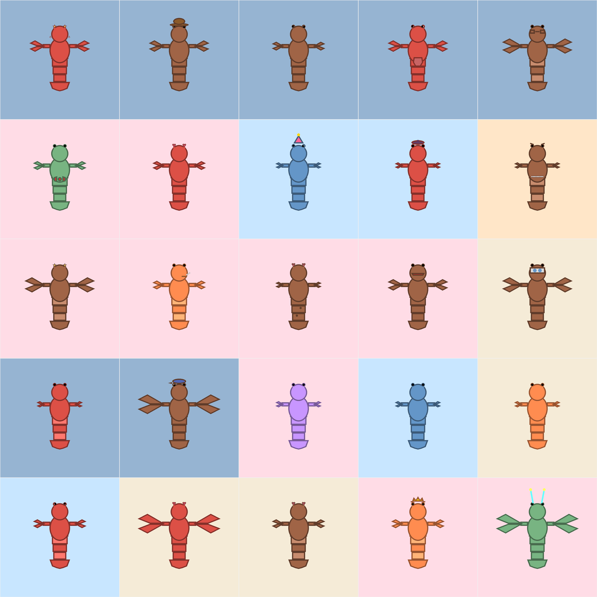
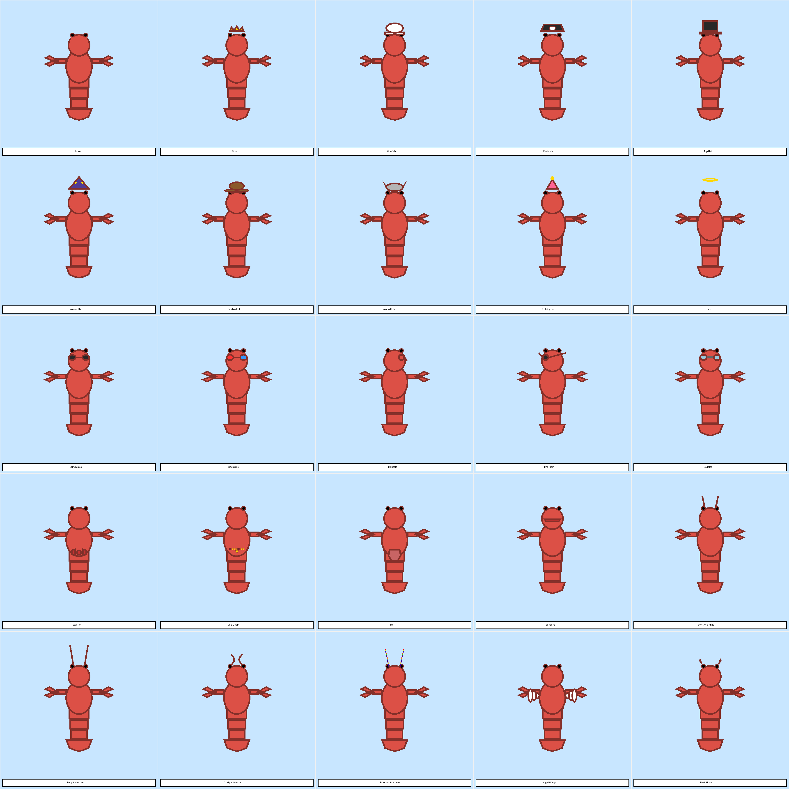
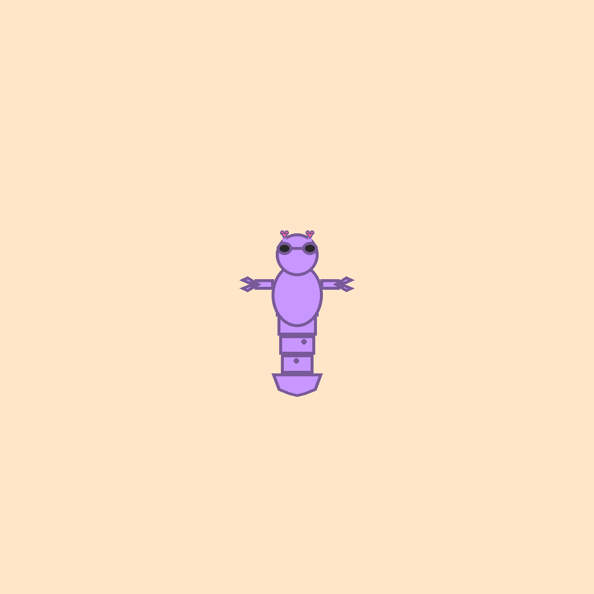

# 🦞 Lobster NFT Generator

A Python-based generative art system for creating unique lobster NFT collections with randomized traits and rarity rankings.

  

## 🎨 Features

- **6 Trait Categories** with 55+ unique trait values
- **Rarity System** with automatic scoring and ranking
- **OpenSea-Compatible Metadata** (JSON format)
- **162,000+ Possible Combinations**
- **Legendary Traits** (Black Pearl, White, Angel Wings, Devil Horns)
- **Clean, Minimalist Art Style**

## 📋 Trait Categories

### 1. Background (6 options)
- Ocean Blue, Deep Sea, Coral Pink, Sandy Beige, Sunset Orange, Mystic Purple (rare)

### 2. Shell Color (9 options)
- Classic Red, Orange, Brown, Blue, Green, Golden, Rainbow
- **Black Pearl (legendary)**, **White (legendary)**

### 3. Claw Size (5 options)
- Small, Medium, Large, Mega, Gigantic

### 4. Eyes (6 options)
- Normal, Googly, Angry, Heart Eyes, Star Eyes, Laser Eyes (rare)

### 5. Tail Pattern (4 options)
- Plain, Striped, Spotted, Fancy

### 6. Accessory (25 options)
**Head Accessories:** Crown, Chef Hat, Pirate Hat, Top Hat, Wizard Hat, Cowboy Hat, Viking Helmet, Birthday Hat, Halo

**Face Accessories:** Sunglasses, 3D Glasses, Monocle, Eye Patch, Goggles

**Body Accessories:** Bow Tie, Gold Chain, Scarf, Bandana

**Antennae:** Short, Long, Curly, Rainbow

**Legendary:** Angel Wings, Devil Horns

## 🚀 Quick Start

### Prerequisites

```bash
pip install Pillow
```

### Generate Your Collection

#### 1. Generate 1,000 Lobsters

```bash
python generate_1000_lobsters.py
```

This will create:
- `lobster_collection_1000/images/` - 1,000 PNG images (1400x1400px)
- `lobster_collection_1000/metadata/` - 1,000 JSON metadata files
- `lobster_collection_1000/collection_summary.json` - Full statistics

#### 2. Preview All Accessories

```bash
python showcase_25_accessories.py
```

Generates a 5x5 grid showcasing all 25 accessories.

#### 3. Generate Random Grid (25 lobsters)

```bash
python simple_lobster.py
```

Creates a 5x5 grid with 25 random lobsters.

## 📁 Project Structure

```
lobster-nft-generator/
├── README.md
├── simple_lobster.py           # Core drawing functions & traits
├── generate_1000_lobsters.py   # Collection generator
├── showcase_25_accessories.py  # Accessory showcase
└── examples/                    # Sample outputs
```

## 🎯 Usage Examples

### Generate Custom Collection Size

Edit `generate_1000_lobsters.py`:

```python
# Change this line at the bottom:
collection, summary_path = generate_collection(num_lobsters=5000)  # Generate 5,000 instead
```

### Modify Trait Rarities

Edit the `TRAITS` dictionary in `simple_lobster.py`:

```python
"Shell Color": {
    "Classic Red": {"color": (220, 80, 70), "rarity": 25},
    "Golden": {"color": (255, 200, 80), "rarity": 7},
    # Adjust rarity percentages (must total 100%)
}
```

### Add New Accessories

1. Add to `TRAITS["Accessory"]` in `simple_lobster.py`
2. Implement drawing code in `draw_simple_lobster()` function

## 📊 Metadata Format

Each NFT includes OpenSea-compatible metadata:

```json
{
  "name": "Lobster #1",
  "description": "A unique generative lobster...",
  "image": "1.png",
  "external_url": "https://your-project-url.com",
  "attributes": [
    {"trait_type": "Background", "value": "Ocean Blue"},
    {"trait_type": "Shell Color", "value": "Classic Red"},
    ...
  ],
  "rarity_score": 485.0,
  "rarity_rank": 1,
  "rarity_percentile": 99.9
}
```

## 🏆 Rarity System

**Rarity Score Calculation:**
- Lower rarity traits = Higher score
- Formula: `Sum of (100 - rarity_percentage)` for each trait
- Higher scores = Rarer lobsters

**Example:**
- Mystic Purple background (2% rarity) = 98 points
- Black Pearl shell (0.5% rarity) = 99.5 points
- Angel Wings (1% rarity) = 99 points
- **Total: 296.5+ points**

## 🎨 Sample Outputs

### Collection Grid


### Accessory Showcase


### Rarest Lobster


## 🛠️ Customization

### Change Image Size

```python
# In simple_lobster.py or generate_1000_lobsters.py
w, h = 2000, 2000  # Change from 1400x1400
```

### Adjust Line Thickness

```python
# In simple_lobster.py
line_thickness = 10  # Change from 7
```

### Modify Colors

```python
# In TRAITS dictionary
"Shell Color": {
    "Custom Color": {"color": (R, G, B), "rarity": 10},
}
```

## 📈 Statistics (1,000 NFT Sample)

- **Most Common Background:** Ocean Blue (31.1%)
- **Most Common Shell:** Classic Red (27.3%)
- **Most Common Eyes:** Normal (38.6%)
- **Rarest Combination:** Rainbow shell + Sunset Orange bg + Legendary accessories

## 🔧 Troubleshooting

**Issue: "No module named 'PIL'"**
```bash
pip install Pillow
```

**Issue: "MemoryError" when generating large collections**
- Generate in batches (e.g., 100 at a time)
- Reduce image size (w, h = 1000, 1000)

**Issue: Accessories not showing**
- Check that accessory drawing code is implemented in `draw_simple_lobster()`
- Verify trait name matches exactly (case-sensitive)

## 📝 License

MIT License - Feel free to use for your own NFT projects!

## 🤝 Contributing

Contributions welcome! Feel free to:
- Add new accessories
- Improve drawing algorithms
- Optimize generation speed
- Add new trait categories

## 🙏 Acknowledgments

Built with:
- Python 3.8+
- Pillow (PIL) for image generation
- Love for lobsters 🦞

## 📞 Contact

For questions or collaborations:
- GitHub Issues: [Open an issue](https://github.com/yourusername/lobster-nft-generator/issues)
- Twitter: @yourhandle

---

**Made with ❤️ and 🦞**

*Generate your own unique lobster NFT collection today!*
